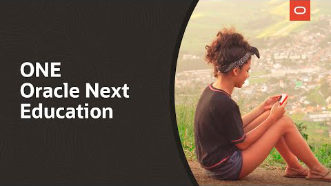

<h1 align="center">
  
  
  
  
  
  
</h1>
<h1 align="center">

</h1>

  <a href="#page_facing_up-descrição">Descrição</a>&nbsp;&nbsp;&nbsp;|&nbsp;&nbsp;&nbsp;
  <a href="#art-Lógica-de-Programação">Lógica de Programação</a>&nbsp;&nbsp;&nbsp;|&nbsp;&nbsp;&nbsp;
  <a href="#front-Front-end">
Front-end</a>&nbsp;&nbsp;&nbsp;|&nbsp;&nbsp;&nbsp;
  <a href="#clipboard-Java">Java</a>&nbsp;&nbsp;&nbsp;|&nbsp;&nbsp;&nbsp;
  <a href="#closed_book-Empreendedorismo">Empreendedorismo</a>&nbsp;&nbsp;&nbsp;|&nbsp;&nbsp;&nbsp;
  <a href="#man-Autor">Autor</a>&nbsp;&nbsp;&nbsp;|&nbsp;&nbsp;&nbsp;
  <a href="#memo-Licença">Licença</a>

## :page_facing_up: Descrição
A ONE (Oracle Next Education) em parceria com a Alura, é um projeto de qualificação na área de empreendedorismo e programação.
Em parceria com a Alura o objetivo do projeto é ensinar o básico de programação aos estudantes.
A página oficial do programa pode ser vista <a href="https://www.alura.com.br/oracle-next-education">aqui<a>.
Nesse repositório será guardado os conteúdos dos quais eu irei aprender no decorrer do curso.

## :art: Lógica de Programação
É o primeiro passo para aprender a programar. Essa trilha tem o objetivo de abrir a cabeça do estudante para a lógica e o mercado de desenvolvimento de software.

## :#front: Front-end
Ajuda a construir experiências fantásticas na web, se aprofundando nas linguagens <b>HTML, CSS e JavaScript</b>.

## :clipboard: Java
Usado para criar aplicativos para computadores, smartphones, tablets e até videogames, o Java é uma das principais linguagens de programação do mundo.

## :closed_book: Empreendedorismo
Você vai aprender os fundamentos básicos do mundo dos negócios para transformar seus conhecimentos e aprender habilidades essenciais para uma carreira de sucesso.

## :man: Autor
<a href="https://github.com/wesleyarm">
 
  
 <b>Wesley Alexandre</b>
</a>

Criado por Wesley Alexandre :wave::wave: Contact!🚀 

## :memo: Licença
Copyright © 2022 [Wesley Alexandre](https://github.com/wesleyarm). 
